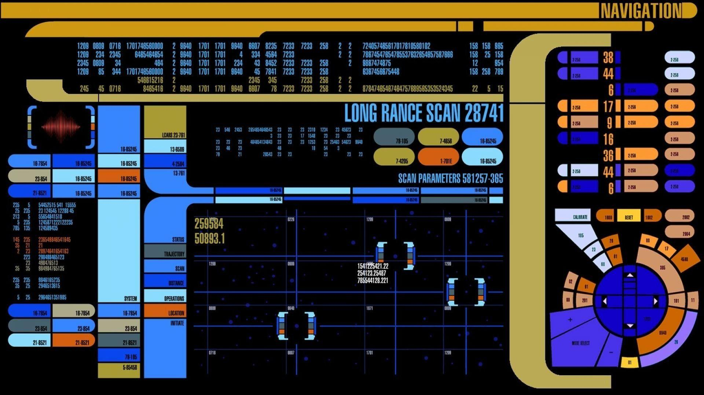
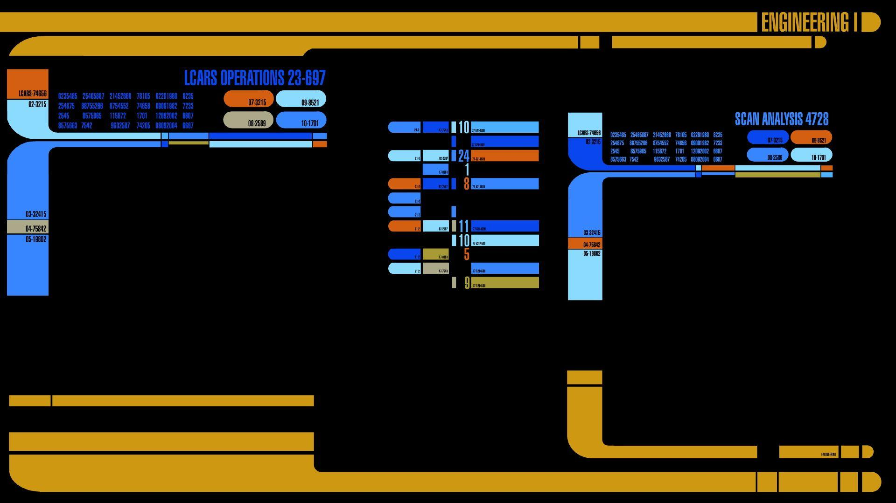
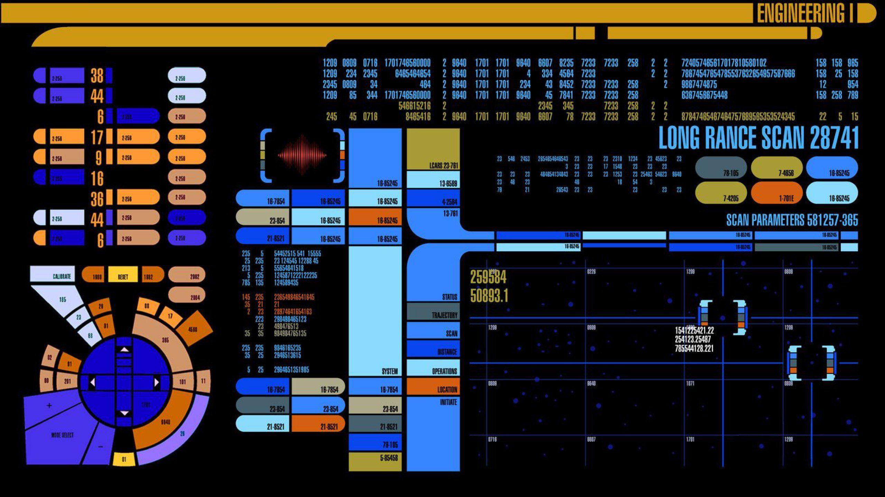
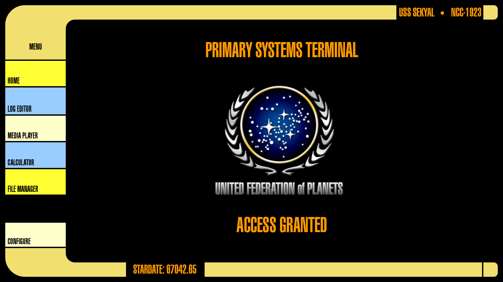
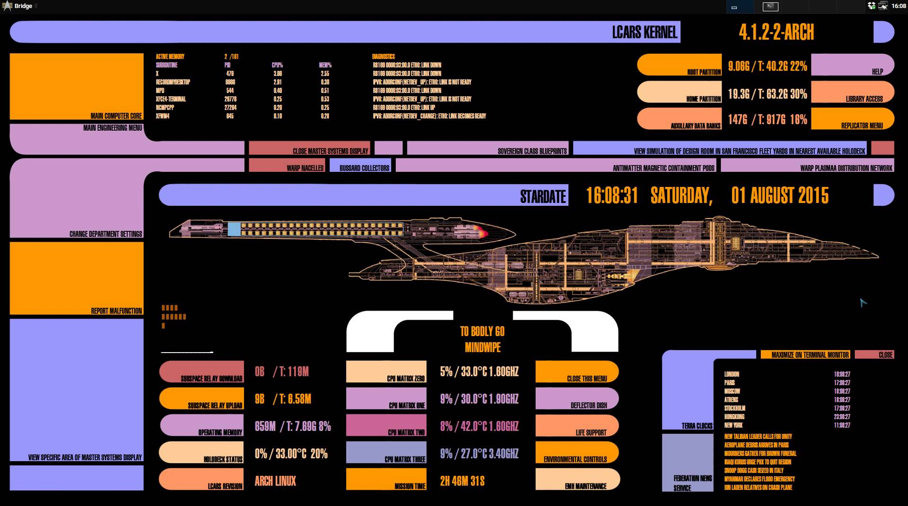
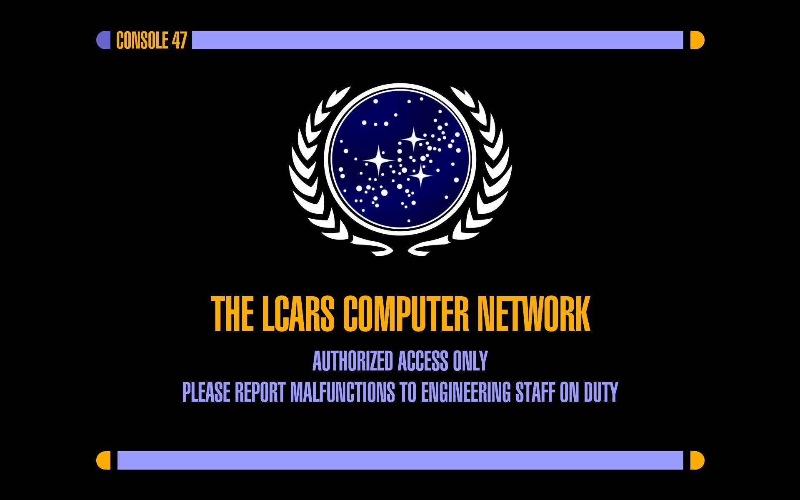
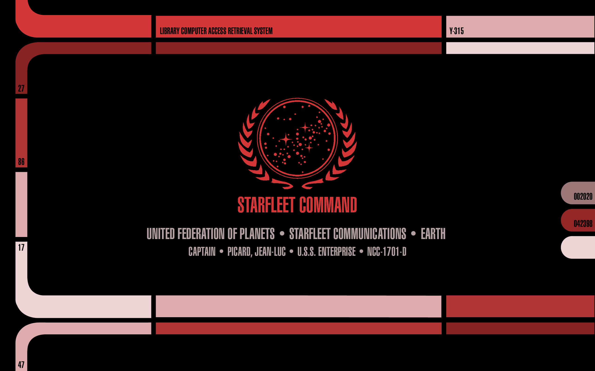
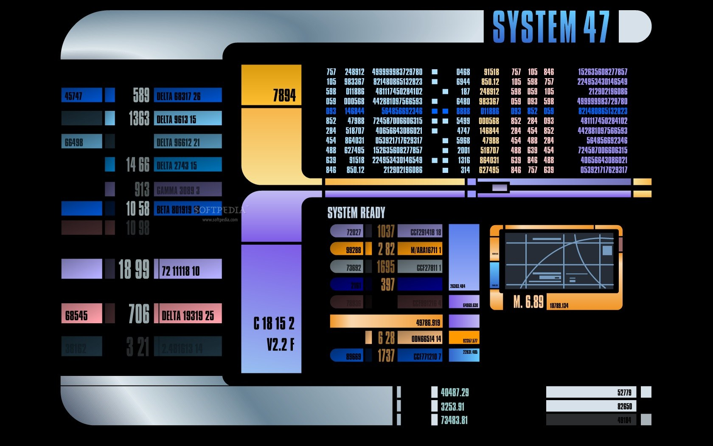
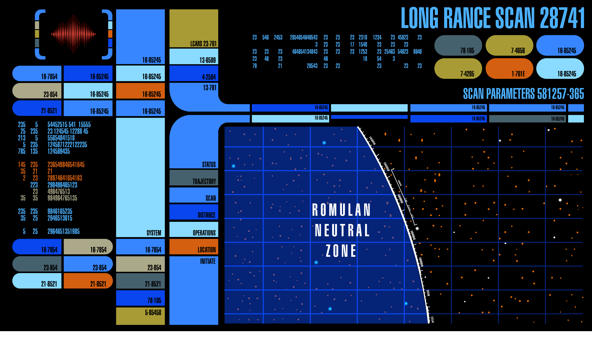

<h1 align="center">
    
</h1>

### This theme is perfect for you if...

- ... you're in Starfleet
- ... you think the LCARS interface is the peak of human-computer interaction.
- ... you?ve accepted that the warp core will need to be ejected eventually.
- ... you consider red shirts a valid life insurance policy.

<br>

<div align="center">
    
    
  <a href="https://www.instagram.com/lioheimberg" target="_blank">
    
  </a>
</div>

## Preview


## Install

Use the Omarchy theme installer:

```bash
omarchy theme install https://github.com/LioHeimberg/omarchy-lcars-theme
```

## Wallpapers

<table>
  <tr>
    <td></td>
    <td></td>
    <td></td>
  </tr>
  <tr>
    <td></td>
    <td></td>
    <td></td>
  </tr>
  <tr>
    <td></td>
    <td></td>
    <td></td>
  </tr>
</table>

## Notes

> [!NOTE]
> This theme is currently in an early stage of development. Don't expect everything to work perfectly and look good yet.

- help me develop the theme and open pull requests!

<hr>

#### ~ Live long and prosper 🖖